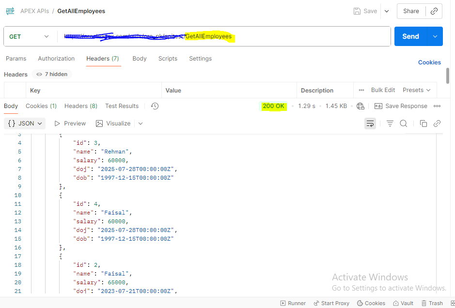
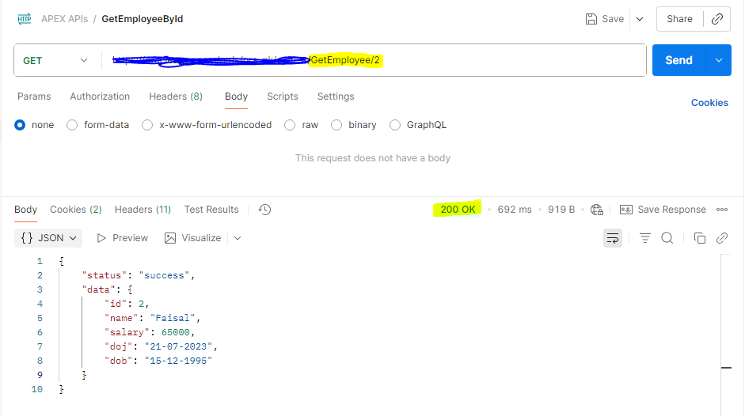
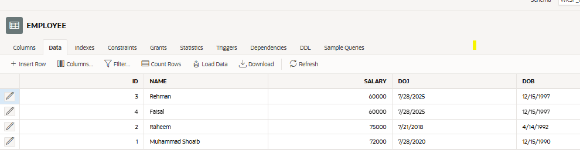
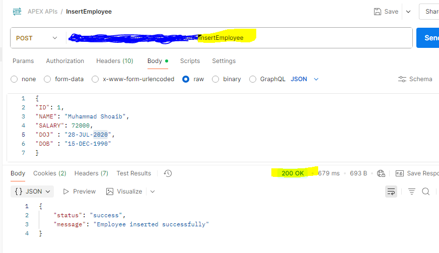
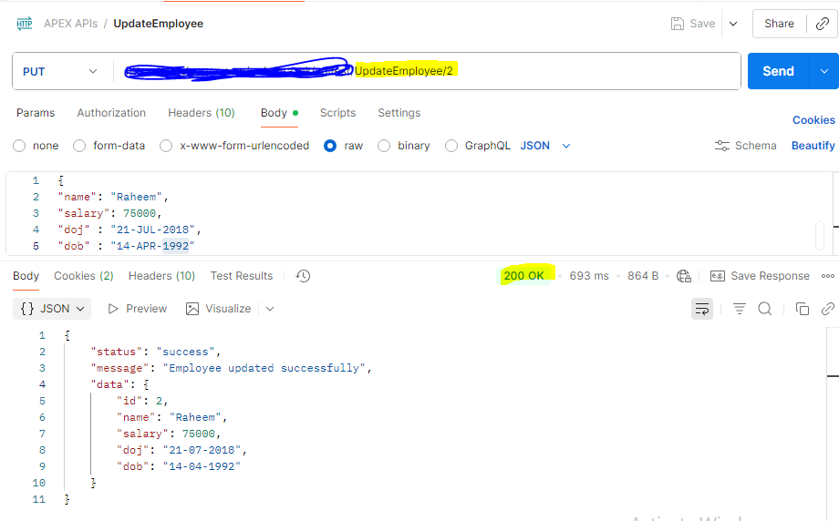
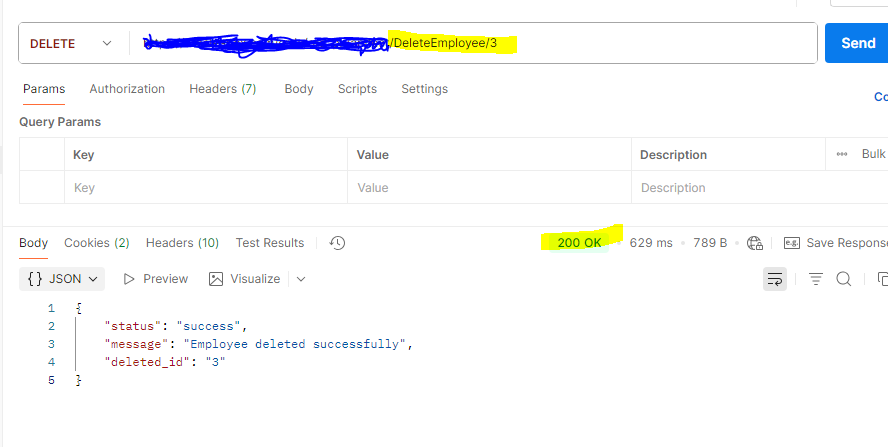

# 🚀 CRUD REST API Project (Oracle APEX)

## 👨‍💻 About the Project

This project is a complete **CRUD REST API system** built using **Oracle APEX / ORDS**, designed to perform Create, Read, Update, and Delete operations on an Employee database. The API is tested and validated using **Postman**, ensuring proper HTTP methods, status codes, and JSON responses.

## 📌 Features
* Create Employee (POST)
* Get All Employees (GET)
* Get Employee by ID (GET)
* Update Employee (PUT)
* Delete Employee (DELETE)
* Proper HTTP Status Codes (200, 201, 400, 404)
* JSON Response Handling
* Tested using Postman
   
## 🛠️ Tech Stack
* Oracle APEX
* Oracle Database (PL/SQL)
* ORDS (REST Data Services)
* Postman (API Testing)
* RESTful Web Services

## 📂 API Endpoints

### 🔹 Get All Employees
GET /apitest/GetAllEmployees

### 🔹 Get Employee by ID
GET /apitest/GetEmployee/:id

### 🔹 Insert Employee
POST /apitest/InsertEmployee

### 🔹 Update Employee
PUT /apitest/UpdateEmployee?id={id}&salary={salary}

### 🔹 Delete Employee
DELETE /apitest/DeleteEmployee/:id

## 📸 Postman API Testing Screenshots

### 🔹 GET All Employees

### 🔹 GET Employee by ID

### 🔹 POST Insert Employee

### 🔹 PUT Update Employee

### 🔹 DELETE Employee

## 📊 Project Highlights

* Real-world REST API implementation
* Proper error handling and validation
* Clean JSON structure responses
* Oracle APEX backend integration
* Tested using Postman collections

## 👤 Author

**Muhammad Shoaib**
Software Engineer | Oracle Developer | Oracle APEX Developer | Oracle Certified Professional

## 📫 Connect with Me

* GitHub: [https://github.com/muhammadshoaib998](https://github.com/muhammadshoaib998)

⭐ If you like this project, don’t forget to star the repository!
